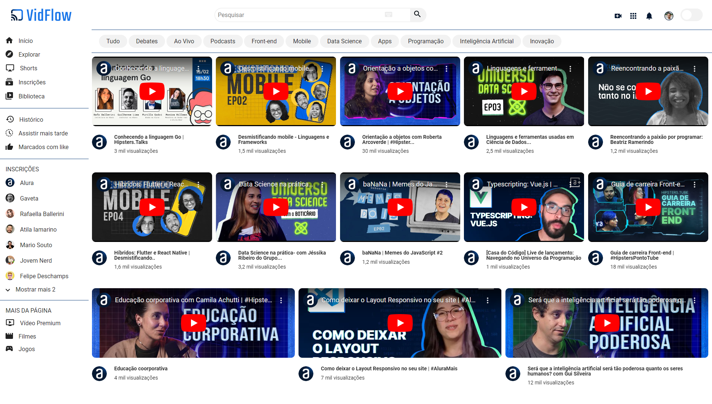

  

VidFlow é uma plataforma de vídeos extraídos do Youtube.

## Tecnologias utilizadas durante o curso
* HTML
* CSS
* JavaScript
* REST API

## Tecnologias utilizadas no projeto
* HTML
* CSS

## O que foi ensinado no curso 

* Aprenda a consumir uma API com JavaScript
* Crie filtros dinâmicos para os dados da API
* Faça a tradução de um layout predefinido em uma aplicação funcional
* Utilize async await para criar funções assíncronas
* Construa uma plataforma de compartilhamento de vídeos
* Conheça as Promises e seus métodos
* Trate possíveis erros de requisição retornados da API

## Melhoria apresentada e executada
* Realizei o ajuste no layout responsivo

 

